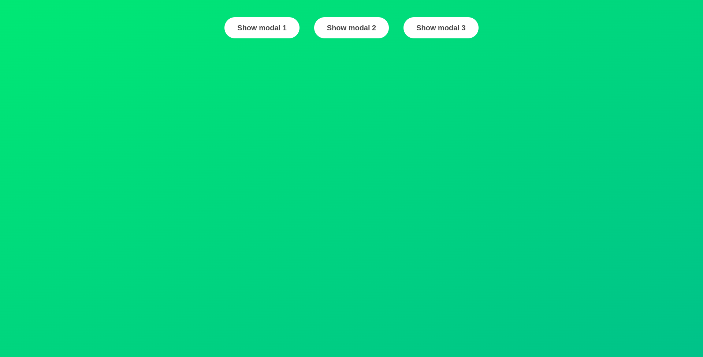
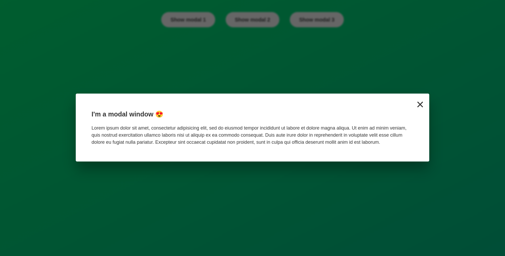

# ModalWindow
Project built during Jonas Schmedtmann's courses on [UDEMY](https://www.udemy.com/course/the-complete-javascript-course/).
[THE WEBSITE](https://paul21777.github.io/modalWindow/)
## Screenshots

## What I learned ?
1. Systematically store my access to the DOM in variable to make their utilization easier
2. Use the classList methode to manipulate class in HTML attributes
3.  An addEventListener create an object of what he listen, and we can manipulate this object to listen a specific key of the keyboard for example
4. The querySelector select only the first element that he meet. To select all the selector of a specific class, we use querySelectorAll. QuerySelectorAll gives us a objet that looks like an array, and we can itearte in this array using a classical for loop (that way we talk the same way to all the element returned by the querySelectorAll).
